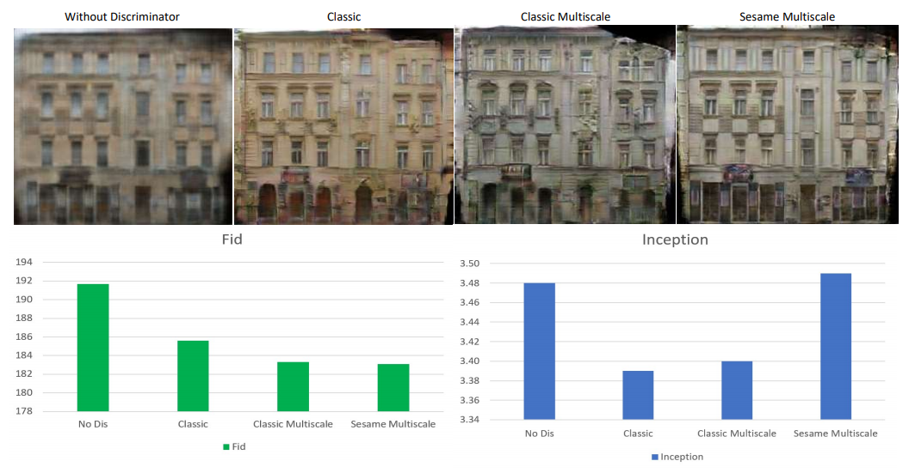

# DLIM Image to Image Translation project

With the advent of self-driving cars and autonomous drone-delivery systems the simplification of a realistic image to a segmented one has never been more essential. Generative adversial networks represent a vital step pushing image to image translation from poor attempts to powerful methods. Apart from aforementioned applications they have proven their usefulness in the artistic community and repeatedly display capabilities previously thought restricted to the human kind. In our project we tackled the task of reconstructing the photoimage of a scene with only its segmentation. For that we based our model on the public pix2pix repository, which has shown quite astonishing results. 

## Table of Contents:
- Baseline
- Prerequisites
- Getting Started
- Using the Inception and FID score
- Batch size experiments
- Perceptual loss
- Adversial losses
- Different discriminators
- Training the pix2pix model on the cityscapes dataset
- Using the GUI to test the most successful model
- Stochastic image net
- Conclusion

## Baseline

This project is heavily based on pix2pix, we in fact started with the repository of pix2pix (https://github.com/junyanz/pytorch-CycleGAN-and-pix2pix) and then modified and added some parts to try our own experiments. Pix2pix is a conditional generative adversial network. A generative adversial network is a combination of a generator and a discriminator. The generator and the discriminator play a game, where the generator tries to convince the discriminator that its generated images are actually real images while also feeding a real image every now and then to it to make the discriminator's decision non-trivial. The generator is a convolutional neural network employing a U-net architecture, where it first several layers of convolution reducing the dimension of the intermediate "image" and then deconvolutes the latent information to reproduce once again a full image. The discriminator is a convolutional neural network with a single output describing its confidence in the realness of a fed image. Although in the case of supervised learning other metrics such as a pixel by pixel eucledian comparison (L2 loss) would be possible as well the discriminator can perform the task unsupervised and even in the case of supervision it was shown to improve the quality of textures in the image. The network is considered conditional, since the generator produces its images conditioned on the segmentation instead of random noise.

Citations for pix2pix:

Unpaired Image-to-Image Translation using Cycle-Consistent Adversarial Networks.<br>
[Jun-Yan Zhu](https://www.cs.cmu.edu/~junyanz/)\*,  [Taesung Park](https://taesung.me/)\*, [Phillip Isola](https://people.eecs.berkeley.edu/~isola/), [Alexei A. Efros](https://people.eecs.berkeley.edu/~efros). In ICCV 2017. (* equal contributions) [[Bibtex]](https://junyanz.github.io/CycleGAN/CycleGAN.txt)


Image-to-Image Translation with Conditional Adversarial Networks.<br>
[Phillip Isola](https://people.eecs.berkeley.edu/~isola), [Jun-Yan Zhu](https://www.cs.cmu.edu/~junyanz/), [Tinghui Zhou](https://people.eecs.berkeley.edu/~tinghuiz), [Alexei A. Efros](https://people.eecs.berkeley.edu/~efros). In CVPR 2017. [[Bibtex]](https://www.cs.cmu.edu/~junyanz/projects/pix2pix/pix2pix.bib)

## Prerequisites
- Linux or macOS
- Python 3
- CPU or NVIDIA GPU + CUDA CuDNN

## Getting Started
### Installation

- Clone this repo:
```bash
git clone https://github.com/nmproduction/DLIM
cd DLIM
```

- Install [PyTorch](http://pytorch.org) and 0.4+ and other dependencies (e.g., torchvision, [visdom](https://github.com/facebookresearch/visdom) and [dominate](https://github.com/Knio/dominate)).
  - For pip users, please type the command `pip install -r requirements.txt`.
  - For Conda users, you can create a new Conda environment using `conda env create -f environment.yml`.
  - follow the instructions in conda-env.txt to install the rest of the required packages using anaconda (you can also use the import button in anaconda navigator and select conda-env.txt)
  
- Install torch-fidelity (https://github.com/toshas/torch-fidelity)
  - For pip users, please type the command `pip install torch-fidelity`.
  - Notice that it might clash with some versions of pytorch, thus it may be inevitable to work with several at once environments.

### Datasets
Most of our work has been done on facades. However, we also looked at the performance on cityscapes. Therefore to verify our results both datasets need to be downloaded.
```
bash ./datasets/download_pix2pix_dataset.sh facades
bash ./datasets/download_pix2pix_dataset.sh cityscapes
```
## Using the Inception and FID score
In the following experiments the inception score and fid score are used extensively. To get these metrics one simply has to run two commands in python. Below you can see an example. To adapt it to different networks only the path of the test results must be adjusted to the previously trained network.
```
from torch_fidelity import calculate_metrics

#runs the inception pretrained classifier and looks how easily it can distinguish different stuff in the generated images
#input1 = first path to sample of images
#input2 = second path to sample of images
#cuda = gpu usage
#isc = inception score
#kid = kernel inception distance
#fid = frechet inception distance
pretrained_metrics = calculate_metrics("./results/facades_label2photo_pretrained/test_latest/images/", "./datasets/facades/test/", cuda=False, isc=True, fid=True, kid=False, verbose=True)
trained_metrics = calculate_metrics("./results/perceptual/test_latest/images/", "./datasets/facades/test/", cuda=False, isc=True, fid=True, kid=False, verbose=True)

print("pretrained metrics", pretrained_metrics)
print("trained metrics for perceptual", trained_metrics)
```
The inceptions score uses a convolutional neural network trained on the ImageNet competition for image classification. It runs it on the images produced by the generative adversial network and measures the level of confidence of the network in the classification of a single produced image as well as the coverage of different classes over the full set of generated images. That way it can both assess the realism of a single image and the variety of images produced. A shortcoming of inception score is that it does a poor job in preventing mode collapse (the behaviour where the network loses the ability of generating some types of images). Mode collapse would occur for example if the network only produced a single realistic image for each class. By generating each class equally often a very good inception score would be expected.

The fid score solves this issue by comparing the generated images directly to actual images. In order to perform this comparison it also uses the inception network trained on imagenet, but on both the generated and real images. It then extracts the output from intermediate layer and calculates its statistics. With the Wasserstein-2/Fréchet metric these two distributions are then compared. This better captures mode collapse than the inception score.

## Batch size experiments
A batch describes a set of datapoints (in our case images) that are fed together to the network. On one hand this helps with computational efficiency, as memory can be copied to the respective devices in larger quantities, on the other hand the gradient in backpropagation is more true to the actual gradient that would be observed for the true risk, since the estimated risk improves the more data is looked at.

Run the following commands in the terminal to train pix2pix with different images per batch and test them. The results should look as below:
```
python ./train.py --dataroot ./datasets/facades --model pix2pix --name batch1 --direction BtoA --batch_size 1
python ./train.py --dataroot ./datasets/facades --model pix2pix --name batch4 --direction BtoA --batch_size 4
python ./train.py --dataroot ./datasets/facades --model pix2pix --name batch16 --direction BtoA --batch_size 16
python ./train.py --dataroot ./datasets/facades --model pix2pix --name batch64 --direction BtoA --batch_size 64
python ./train.py --dataroot ./datasets/facades --model pix2pix --name batch256 --direction BtoA --batch_size 256

python ./test.py --dataroot ./datasets/facades --direction BtoA --model pix2pix --name batch1
python ./test.py --dataroot ./datasets/facades --direction BtoA --model pix2pix --name batch4
python ./test.py --dataroot ./datasets/facades --direction BtoA --model pix2pix --name batch16
python ./test.py --dataroot ./datasets/facades --direction BtoA --model pix2pix --name batch64
python ./test.py --dataroot ./datasets/facades --direction BtoA --model pix2pix --name batch256
```
Below you can see the results that we achieved together with the score on inception and fid.


Since we strive for a high inception score and a low fid score (upward for both scores in the graph) there seems to be little correlation between the overall quality of the image and the batch size. However, upon closer inspection one sees that with fewer images surfaces are smoother and the images display fewer artifacts.

## Perceptual loss
We used parts of the SPADE network (https://github.com/NVlabs/SPADE) to swap an L1 loss for a higher level perceptual loss. For that we added another class to the model folder. You can try it out by simply running it in the terminal`
```
python ./train.py --dataroot ./datasets/facades --model perceptual --name perceptual --direction BtoA 
python ./test.py --dataroot ./datasets/facades --direction BtoA --model perceptual --name perceptual 
```
Below you can see the results that we achieved together with the score on inception and fid.
 

A perceptual loss is calculated by not comparing two images pixel by pixel, but rather first pass them through an image classifier (such as inception trained on the dataset from the imageNet competition) and then compare some intermediate layer from the network. This way we do not train the network to produce the correct pixels, which are of course very unclear when just looking at a segmentation, but rather to generate a realistic looking image with the right "stuff" in it.

## Adversarial losses
We once again oriented ourselves on SPADES and implemented different losses that also compare the fake image directly to the correct one (no usage of perceptual loss). Instead of the usual minimax loss once can try LSGAN, WGAN and Hinge WGAN. The adjusted model (with the option loss) is saved in models/adversarial_losses_model.py
```
python ./train.py --dataroot ./datasets/facades --model adversarial_losses --name adv_og --direction BtoA --gan_mode original
python ./test.py --dataroot ./datasets/facades --direction BtoA --model adversarial_losses --name adv_og

python ./train.py --dataroot ./datasets/facades --model adversarial_losses --name adv_ls --direction BtoA --gan_mode ls
python ./test.py --dataroot ./datasets/facades --direction BtoA --model adversarial_losses --name adv_ls

python ./train.py --dataroot ./datasets/facades --model adversarial_losses --name adv_hinge --direction BtoA --gan_mode hinge
python ./test.py --dataroot ./datasets/facades --direction BtoA --model adversarial_losses --name adv_hinge 

python ./train.py --dataroot ./datasets/facades --model adversarial_losses --name adv_w --direction BtoA --gan_mode w
python ./test.py --dataroot ./datasets/facades --direction BtoA --model adversarial_losses --name adv_w 
```
To then test the fidelity score we run
```
from torch_fidelity import calculate_metrics

#runs the inception pretrained classifier and looks how easily it can distinguish different stuff in the generated images
#input1 = first path to sample of images
#input2 = second path to sample of images
#cuda = gpu usage
#isc = inception score
#kid = kernel inception distance
#fid = frechet inception distance
cross_entropy_metric = calculate_metrics("./results/adv_og/test_latest/images/", "./datasets/facades/test/", cuda=False, isc=True, fid=True, kid=False, verbose=True)
least_squares_metric = calculate_metrics("./results/adv_ls/test_latest/images/", "./datasets/facades/test/", cuda=False, isc=True, fid=True, kid=False, verbose=True)
hinge_metric = calculate_metrics("./results/adv_hinge/test_latest/images/", "./datasets/facades/test/", cuda=False, isc=True, fid=True, kid=False, verbose=True)
wasserstein_metric = calculate_metrics("./results/adv_w/test_latest/images/", "./datasets/facades/test/", cuda=False, isc=True, fid=True, kid=False, verbose=True)

print("cross_entropy_metric", cross_entropy_metric)
print("least_squares_metric", least_squares_metric)
print("hinge_metric", hinge_metric)
print("wasserstein_metric", wasserstein_metric)
```

Our results are as follows:


All these losses try to allow both the generator and discriminator to simultaneously improve their capabilities in a neverending battle. However, for them to make progress it is vital that this battle is balanced. Otherwise one might come to dominate the other, upon which the fight would come to a halt and training would become static. Whereas the minimax loss assumes the output of the discriminator to be probabilites of the image being real/fake the Wasserstein loss is more adaptive. It does not assume classification as real or fake, but rather a "critic" value that ranks images on their respective realness. In order to tackle the problem of saturating gradients when either of the model is vastly outperformed by the other (occuring through sigmoid functions) we can use the least squares gan loss. It penalizes the classification/generation of images proportionally to how far it is off the actual class. Therefore the gradient can only become 0 upon perfect classification/generation of images and the training never plateaus. Through application of a hinge loss for the discriminator/generator pair we effectively search for a support vector machine hyperplane to best/worst separate real and fake images. This also removes the issue of vanishing gradients, since the gradient with respect to the hinge loss is constant on one side of the hyperplane (with a minor offset enforcing the most likely hyperplane even upon perfect performance in respect to the data).


## Different Discimintators
Run following code:
Classical pix2pix discriminator
```
python ./train.py --dataroot ./datasets/facades --model pix2pix --name classic --direction BtoA
python ./test.py --dataroot ./datasets/facades --direction BtoA --model pix2pix --name classic
```
Classical pix2pix multiscale discriminator 
```
python ./train.py --dataroot ./datasets/facades --model pix2pix --name classic --direction BtoA --netD multiscale 
python ./test.py --dataroot ./datasets/facades --direction BtoA --model pix2pix --name classic
```
Sesame multiscale discriminator
```
python ./trainSesame.py --dataroot ./datasets/facades --model pix2pix --name classic --direction BtoA --netD sesam 
python ./test.py --dataroot ./datasets/facades --direction BtoA --model pix2pix --name classic
```
Our results are:



## Training the pix2pix model on the cityscapes dataset

 for training: in the command line run `python train.py --n_epochs 100 --n_epochs_decay 100 --dataroot ./datasets/cityscapes --name cityscapes_pix2pix --model pix2pix --direction BtoA`

the dataset is contained already in the repo

for testing run `python test.py --dataroot ./datasets/cityscapes --direction BtoA --model pix2pix --name cityscapes_pix2pix`


## Using the GUI for testing the most successful model
https://github.com/switchablenorms/CelebAMask-HQ

 1. Execute the file MaskGAN_demo\demo_cityscapes.py using the command `python MaskGAN_demo\demo_cityscapes.py`
 2. in the GUI select a input image form the images folder in the same directory and the corresponding labels

## Stochastic Image Net
In order to produce stochasticity in the generated images after having trained a definite network we kept dropout enabled even when testing. For that we use the model stochastic_model.py Furthermore we increased the dropout strength from 0.5 to 0.95 by changing line 456 and 566 in models/networks.py. This should be repeated to reproduce the results. To train the stochastic model we run
```
python ./train.py --dataroot ./datasets/facades --model stochastic --name stoch --direction BtoA 
python ./test.py --dataroot ./datasets/facades --direction BtoA --model stochastic --name stoch 
```
We can already look at the results on the test set. Rerunning 
```
python ./test.py --dataroot ./datasets/facades --direction BtoA --model stochastic --name stoch 
```
will now yield differently looking facades.


However, we notice that the quality of the images suffers greatly with this modification. There is a tradeoff between stochasticity and accuracy when using a solution with dropout it would seem.

After trying this out we read up on different approaches and it turns out that there is another method that should give better results. Stochasticity is usually introduced through the addition of noise. However, adding noise as an additonal input will likely make the network ignore it since we have direct comparison metrics such as L1- and L2-loss. Therefore we need another solution. Instead of using dropout, stochasticity could be added to the model by a random noise overlaid on the weights at various points in the network. 

## Conclusion
Alex/Philip what did you conclude?
