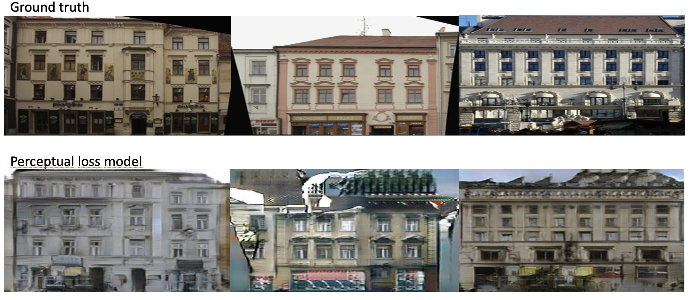
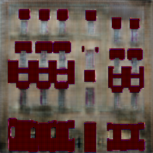
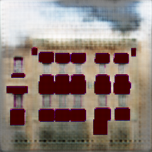

# DLIM Image to Image Translation project

This project is heavily based on pix2pix, we in fact started with the repository of pix2pix (https://github.com/junyanz/pytorch-CycleGAN-and-pix2pix) and then modified and added some parts to try our own experiments. Therefore, before getting started it is important to set up all requirements for pix2pix thus part of the readme of the original repository is listed below, after which additional instructions will be added.

Citations for pix2pix:

Unpaired Image-to-Image Translation using Cycle-Consistent Adversarial Networks.<br>
[Jun-Yan Zhu](https://www.cs.cmu.edu/~junyanz/)\*,  [Taesung Park](https://taesung.me/)\*, [Phillip Isola](https://people.eecs.berkeley.edu/~isola/), [Alexei A. Efros](https://people.eecs.berkeley.edu/~efros). In ICCV 2017. (* equal contributions) [[Bibtex]](https://junyanz.github.io/CycleGAN/CycleGAN.txt)


Image-to-Image Translation with Conditional Adversarial Networks.<br>
[Phillip Isola](https://people.eecs.berkeley.edu/~isola), [Jun-Yan Zhu](https://www.cs.cmu.edu/~junyanz/), [Tinghui Zhou](https://people.eecs.berkeley.edu/~tinghuiz), [Alexei A. Efros](https://people.eecs.berkeley.edu/~efros). In CVPR 2017. [[Bibtex]](https://www.cs.cmu.edu/~junyanz/projects/pix2pix/pix2pix.bib)

## Prerequisites
- Linux or macOS
- Python 3
- CPU or NVIDIA GPU + CUDA CuDNN

## Getting Started
### Installation

- Clone this repo:
```bash
git clone https://github.com/nmproduction/DLIM
cd DLIM
```

- Install [PyTorch](http://pytorch.org) and 0.4+ and other dependencies (e.g., torchvision, [visdom](https://github.com/facebookresearch/visdom) and [dominate](https://github.com/Knio/dominate)).
  - For pip users, please type the command `pip install -r requirements.txt`.
  - For Conda users, you can create a new Conda environment using `conda env create -f environment.yml`.
  - follow the instructions in conda-env.txt to install the rest of the required packages using anaconda (you can also use the import button in anaconda navigator and select conda-env.txt)

### pix2pix simple train/test
- Download a pix2pix dataset (e.g.[facades](http://cmp.felk.cvut.cz/~tylecr1/facade/)):
```bash
bash ./datasets/download_pix2pix_dataset.sh facades
```
- To view training results and loss plots, run `python -m visdom.server` and click the URL http://localhost:8097.
- Train a model:
```bash
#!./scripts/train_pix2pix.sh
python train.py --dataroot ./datasets/facades --name facades_pix2pix --model pix2pix --direction BtoA
```
To see more intermediate results, check out  `./checkpoints/facades_pix2pix/web/index.html`.

- Test the model (`bash ./scripts/test_pix2pix.sh`):
```bash
#!./scripts/test_pix2pix.sh
python test.py --dataroot ./datasets/facades --name facades_pix2pix --model pix2pix --direction BtoA
```
- The test results will be saved to a html file here: `./results/facades_pix2pix/test_latest/index.html`. You can find more scripts at `scripts` directory.
- To train and test pix2pix-based colorization models, please add `--model colorization` and `--dataset_mode colorization`. See our training [tips](https://github.com/junyanz/pytorch-CycleGAN-and-pix2pix/blob/master/docs/tips.md#notes-on-colorization) for more details.

### Apply a pre-trained model (pix2pix)
Download a pre-trained model with `./scripts/download_pix2pix_model.sh`.

- Check [here](https://github.com/junyanz/pytorch-CycleGAN-and-pix2pix/blob/master/scripts/download_pix2pix_model.sh#L3) for all the available pix2pix models. For example, if you would like to download label2photo model on the Facades dataset,
```bash
bash ./scripts/download_pix2pix_model.sh facades_label2photo
```
- Download the pix2pix facades datasets:
```bash
bash ./datasets/download_pix2pix_dataset.sh facades
```
- Then generate the results using
```bash
python test.py --dataroot ./datasets/facades/ --direction BtoA --model pix2pix --name facades_label2photo_pretrained
```
- Note that we specified `--direction BtoA` as Facades dataset's A to B direction is photos to labels.

- If you would like to apply a pre-trained model to a collection of input images (rather than image pairs), please use `--model test` option. See `./scripts/test_single.sh` for how to apply a model to Facade label maps (stored in the directory `facades/testB`).

- See a list of currently available models at `./scripts/download_pix2pix_model.sh`

## [Datasets](docs/datasets.md)
Download pix2pix datasets and create your own datasets.

## [Training/Test Tips](docs/tips.md)
Best practice for training and testing your models.

## [Frequently Asked Questions](docs/qa.md)
Before you post a new question, please first look at the above Q & A and existing GitHub issues.

## Custom Model and Dataset
If you plan to implement custom models and dataset for your new applications, we provide a dataset [template](data/template_dataset.py) and a model [template](models/template_model.py) as a starting point.

## [Code structure](docs/overview.md)
To help users better understand and use our code, we briefly overview the functionality and implementation of each package and each module.


# DLIM Image Domain Transfer additional requirements

Please install torch-fidelity, since it is used in many places to evaluate our results. 
https://github.com/toshas/torch-fidelity
the easiest way to install it is using pip. Notice that it might clash with some versions of pytorch, thus it may be inevitable to work with several environments.

In the following experiments the fid score and inception scores are used extensively. To get these metrics one simply has to run two commands in python. Below you can see an example. To adapt it to different networks only the path of the test results must be adjusted to the previously trained network.

```
from torch_fidelity import calculate_metrics

#runs the inception pretrained classifier and looks how easily it can distinguish different stuff in the generated images
#input1 = first path to sample of images
#input2 = second path to sample of images
#cuda = gpu usage
#isc = inception score
#kid = kernel inception distance
#fid = frechet inception distance
pretrained_metrics = calculate_metrics("./results/facades_label2photo_pretrained/test_latest/images/", "./datasets/facades/test/", cuda=False, isc=True, fid=True, kid=False, verbose=True)
trained_metrics = calculate_metrics("./results/perceptual/test_latest/images/", "./datasets/facades/test/", cuda=False, isc=True, fid=True, kid=False, verbose=True)

print("pretrained metrics", pretrained_metrics)
print("trained metrics for perceptual", trained_metrics)
```


# Batch size experiments
Run the following commands in the terminal to train pix2pix with different images per batch and test them. The results should look as below:
```
python ./train.py --dataroot ./datasets/facades --model pix2pix --name batch1 --direction BtoA --batch_size 1
python ./train.py --dataroot ./datasets/facades --model pix2pix --name batch4 --direction BtoA --batch_size 4
python ./train.py --dataroot ./datasets/facades --model pix2pix --name batch16 --direction BtoA --batch_size 16
python ./train.py --dataroot ./datasets/facades --model pix2pix --name batch64 --direction BtoA --batch_size 64
python ./train.py --dataroot ./datasets/facades --model pix2pix --name batch256 --direction BtoA --batch_size 256

python ./test.py --dataroot ./datasets/facades --direction BtoA --model pix2pix --name batch1
python ./test.py --dataroot ./datasets/facades --direction BtoA --model pix2pix --name batch4
python ./test.py --dataroot ./datasets/facades --direction BtoA --model pix2pix --name batch16
python ./test.py --dataroot ./datasets/facades --direction BtoA --model pix2pix --name batch64
python ./test.py --dataroot ./datasets/facades --direction BtoA --model pix2pix --name batch256
```
Below you can see the results that we achieved together with the score on inception and fid.


# Perceptual loss
We used parts of the SPADE network (https://github.com/NVlabs/SPADE) to swap an L1 loss for a higher level perceptual loss. For that we added another class to the model folder. You can try it out by simply running it in the terminal`
```
python ./train.py --dataroot ./datasets/facades --model perceptual --name perceptual --direction BtoA 
python ./test.py --dataroot ./datasets/facades --direction BtoA --model perceptual --name perceptual 
```
Below you can see the results that we achieved together with the score on inception and fid.
 

# Adversarial losses
We once again oriented ourselves on SPADES and implemented different losses that also compare the fake image directly to the correct one. Instead of L1 once can try LSGAN, WGAN and Hinge WGAN. The adjusted model (with an option loss) is saved in models/adversarial_losses_model.py
```
python ./train.py --dataroot ./datasets/facades --model adversarial_losses --name adv_og --direction BtoA --gan_mode original
python ./test.py --dataroot ./datasets/facades --direction BtoA --model adversarial_losses --name adv_og

python ./train.py --dataroot ./datasets/facades --model adversarial_losses --name adv_ls --direction BtoA --gan_mode ls
python ./test.py --dataroot ./datasets/facades --direction BtoA --model adversarial_losses --name adv_ls

python ./train.py --dataroot ./datasets/facades --model adversarial_losses --name adv_hinge --direction BtoA --gan_mode hinge
python ./test.py --dataroot ./datasets/facades --direction BtoA --model adversarial_losses --name adv_hinge 

python ./train.py --dataroot ./datasets/facades --model adversarial_losses --name adv_w --direction BtoA --gan_mode w
python ./test.py --dataroot ./datasets/facades --direction BtoA --model adversarial_losses --name adv_w 
```
To then test the fidelity score we run
```
from torch_fidelity import calculate_metrics

#runs the inception pretrained classifier and looks how easily it can distinguish different stuff in the generated images
#input1 = first path to sample of images
#input2 = second path to sample of images
#cuda = gpu usage
#isc = inception score
#kid = kernel inception distance
#fid = frechet inception distance
cross_entropy_metric = calculate_metrics("./results/adv_og/test_latest/images/", "./datasets/facades/test/", cuda=False, isc=True, fid=True, kid=False, verbose=True)
least_squares_metric = calculate_metrics("./results/adv_ls/test_latest/images/", "./datasets/facades/test/", cuda=False, isc=True, fid=True, kid=False, verbose=True)
hinge_metric = calculate_metrics("./results/adv_hinge/test_latest/images/", "./datasets/facades/test/", cuda=False, isc=True, fid=True, kid=False, verbose=True)
wasserstein_metric = calculate_metrics("./results/adv_w/test_latest/images/", "./datasets/facades/test/", cuda=False, isc=True, fid=True, kid=False, verbose=True)

print("cross_entropy_metric", cross_entropy_metric)
print("least_squares_metric", least_squares_metric)
print("hinge_metric", hinge_metric)
print("wasserstein_metric", wasserstein_metric)
```

Our results are as follows:


## Different Discimintators
We did want to see the effect of the discriminator on the final result. So, we did compare the results of three different discriminators and the results of the pix2pix model with no discriminator. This was achieved by commenting out the training and the effect on the generator training in the train.py script.
The comparison of the different discriminators showed that the discriminator is important for a realistic image. This effect can be amplified by using a multiscale discriminator or different kinds of discriminators.


Our results are:


To reconstruct the results, run following code:

Classical pix2pix discriminator
```
python ./train.py --dataroot ./datasets/facades --model pix2pix --name classic --direction BtoA
python ./test.py --dataroot ./datasets/facades --direction BtoA --model pix2pix --name classic
```
Classical pix2pix multiscale discriminator 
```
python ./train.py --dataroot ./datasets/facades --model pix2pix --name classic --direction BtoA --netD multiscale 
python ./test.py --dataroot ./datasets/facades --direction BtoA --model pix2pix --name classic
```
Sesame multiscale discriminator
```
python ./train.py --dataroot ./datasets/facades --model pix2pix --name sesame --direction BtoA --netD sesam 
python ./test.py --dataroot ./datasets/facades --direction BtoA --model pix2pix --name sesame
```


## Training the pix2pix model on the cityscapes dataset

 for training: in the command line run `python train.py --n_epochs 100 --n_epochs_decay 100 --dataroot ./datasets/cityscapes --name cityscapes_pix2pix --model pix2pix --direction BtoA`

the dataset is contained already in the repo

for testing run `python test.py --dataroot ./datasets/cityscapes --direction BtoA --model pix2pix --name cityscapes_pix2pix`


## Using the GUI for testing the most successful model
https://github.com/switchablenorms/CelebAMask-HQ

 1. Execute the file MaskGAN_demo\demo_cityscapes.py using the command `python MaskGAN_demo\demo_cityscapes.py`
 2. in the GUI select a input image form the images folder in the same directory and the corresponding labels

## Stochastic Image Net
In order to produce stochasticity in the generated images after having trained a definite network we kept dropout enabled even when testing. For that we use the model stochastic_model.py Furthermore we increased the dropout strength from 0.5 to 0.95 by changing line 456 and 566 in models/networks.py. This should be repeated to reproduce the results. To train the stochastic model we run
```
python ./train.py --dataroot ./datasets/facades --model stochastic --name stoch --direction BtoA 
python ./test.py --dataroot ./datasets/facades --direction BtoA --model stochastic --name stoch 
```
We can already look at the results on the test set. Rerunning 
```
python ./test.py --dataroot ./datasets/facades --direction BtoA --model stochastic --name stoch 
```
will now yield differently looking facades.


However, we notice that the quality of the images suffers greatly with this modification. There is a tradeoff between stochasticity and accuracy when using a solution with dropout it would seem.

After trying this out we read up on different approaches and it turns out that there is another method that should give better results. Stochasticity is usually introduced through the addition of noise. However, adding noise as an additonal input will likely make the network ignore it since we have direct comparison metrics such as L1- and L2-loss. Therefore we need another solution. Instead of using dropout, stochasticity could be added to the model by a random noise overlaid on the weights at various points in the network. 

## Adding random noise to convolution layers
As mentioned above, we are trying to add random noise to the weights of the convolution layer of the generator.
After each training epoch we add random noise to one random weight per convolution.

The first attempt by adding a random noise between 0 and 10 gave following results.
```
convs[numconv].weight[[coor[0],coor[1],coor[2],coor[3]]] += noiceAmplitude * tensor.random(1)
```


The second attempt by amplifying the weight by -10 or 10 did end with no results because after the 25th epoch the Loss function where 'nan'.
```
convs[numconv].weight[[coor[0],coor[1],coor[2],coor[3]]] *= noiceAmplitude * randomSign()
```

